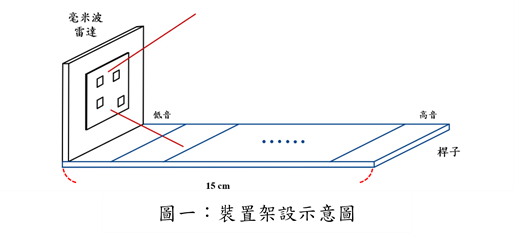

# 2024毫米波AI競賽
## 主題: Otamatone實作
## 成員:
- 陳奕羱
- 張簡雲翔
- 劉德權
- 王駿彥
## 摘要
Otamatone是一種外型類似八分音符的電子樂器，其結構分為尾巴和嘴巴兩部分。尾巴控制音高，操作方式類似弦樂器，手指的位置決定音高；嘴巴則負責發聲。與傳統弦樂器相比，Otamatone操作更簡單，只需注意一根“弦”即可，不需承受按壓弦的疼痛。其設計輕便，不需共鳴箱或拾音器，因此攜帶方便。然而，Otamatone售價較高，且音色單一。為了解決這些問題，我們計劃設計一個僅具指壓功能的Otamatone，供初學者練習手指按位。

## 實作方法
先將毫米波雷達套件固定在任一長度約十五公分左右的桿子上上，並垂直於桿子，在毫米波雷達套件前方繪製一個軌道，模擬Otamatone的尾巴結構，將其均分成九段，其中前面七段分別代表Do、Re、Mi、Fa、So、La、Si這七個基本音符，最後兩段則是音量變大及音量變小（圖一）。

透過前項已經設定好的裝置以及相關軟體，用手分別在Otamatone軌道區域的按下不同位置並讓毫米波雷達套件來偵測距離後，收集毫米波雷達套件所讀取到的資料並且標註對應的label，待收集一定程度的資料量後，透過這些資料作為資料集，訓練一個機器學習的模型，用來判斷目前手所放的的高度是甚麼樣的音高。

最後藉由pygame這個模組來呼叫windows的合成器來發出聲音，並使用GUI介面來調整我們所想要發出的音色。

## Dataset
### Data Collect
透過官方提供的Collect_RDI軟體裡面的pre define的mode，設定固定frame是動作標記，並設定10個frames為固定間隔，由於硬體效能的限制導致資料前處理過久，所以總共收集的frame數量僅為190個，且為經過Fourier Transform後的資料。

### Data Preprocess

### Data Split

## Instruction
